# AI-ACC State Machines
> Generated: 2026-09-20 | Confidence: HIGH (code-traced)

## Sales Invoice
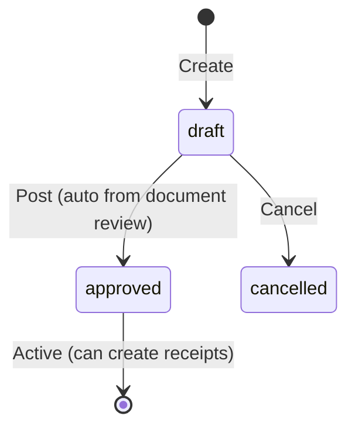
- **draft → approved**: `POST /sales/invoices/:id/post` → SalesService.Post → PostingEngine → JournalEntry
- **draft → cancelled**: `DELETE /sales/invoices/:id` → SalesService.Cancel
- **Note**: Status stays 'approved' after full receipt (no 'paid' status)

## Purchase Invoice (New Flow)
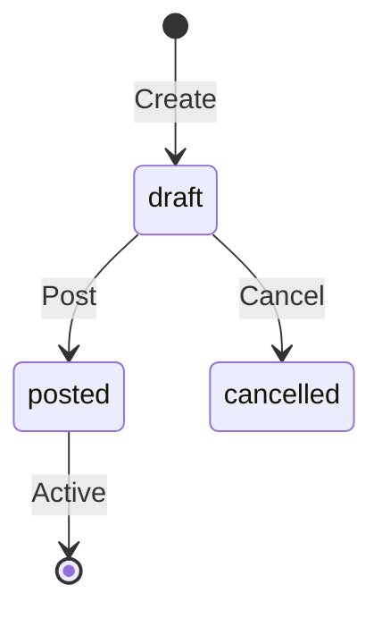
- **draft → posted**: `POST /purchase/invoices/:id/post` → PurchaseInvoiceFlowService.Post
- **draft → cancelled**: `POST /purchase/invoices/:id/cancel`

## Journal Entry
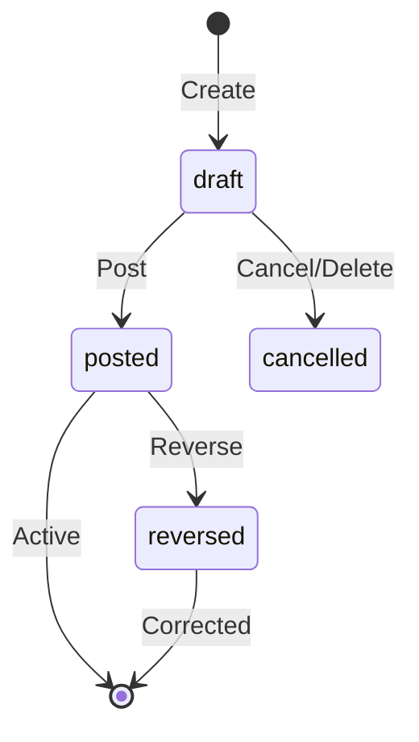
- **draft → posted**: `POST /journal/entries/:id/post` (requires `journal.post` permission)
- **posted → reversed**: `POST /journal/entries/:id/reverse` (requires `journal.post` permission)
- **draft → cancelled**: `DELETE /journal/entries/:id` or `POST /journal/entries/:id/cancel`

## Receipt

- **draft → posted**: `POST /receipts/:id/post` → ReceiptService.Post → PostingEngine → JournalEntry

## Credit/Debit Note (Sales)
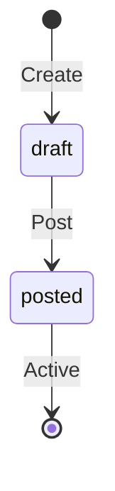

## Purchase Order
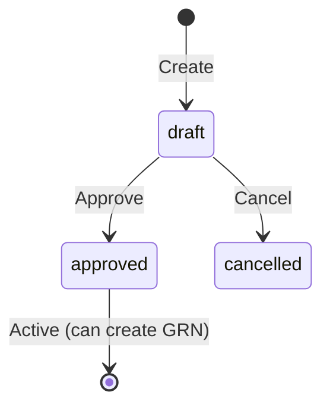

## GRN (Goods Received Note)
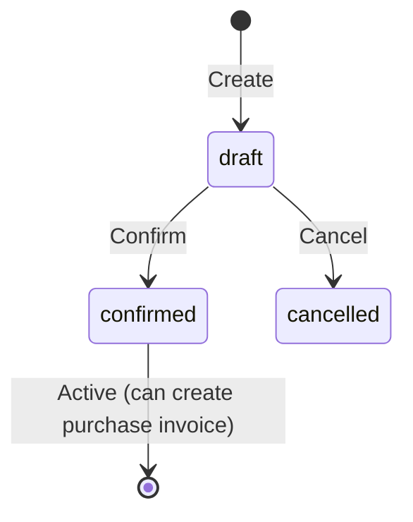

## Quotation
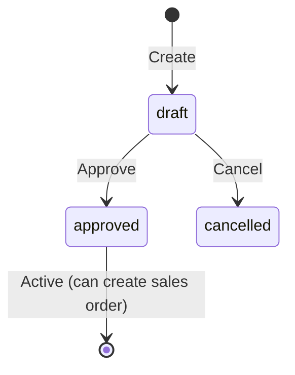

## Delivery Order
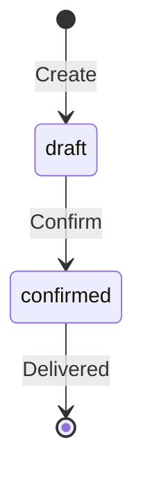

## Billing Document
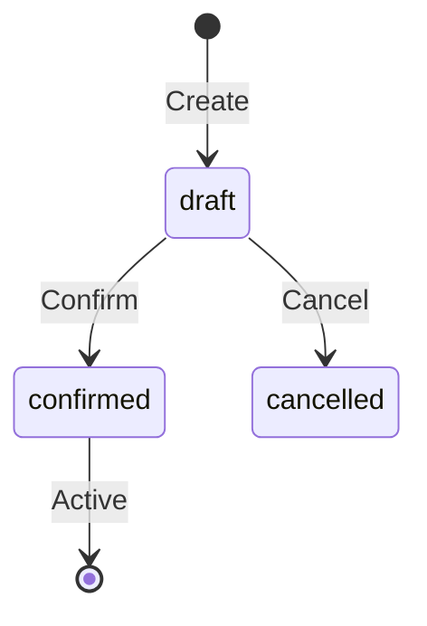

## Document (OCR Upload)
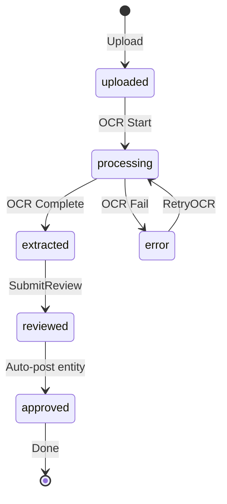

## Fixed Asset
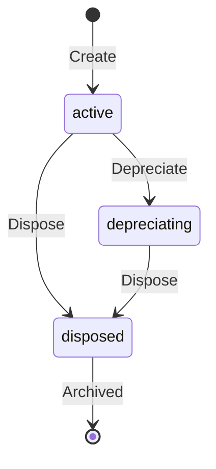

## Payroll Record
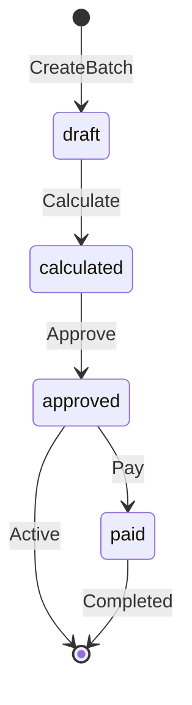

## Period Close
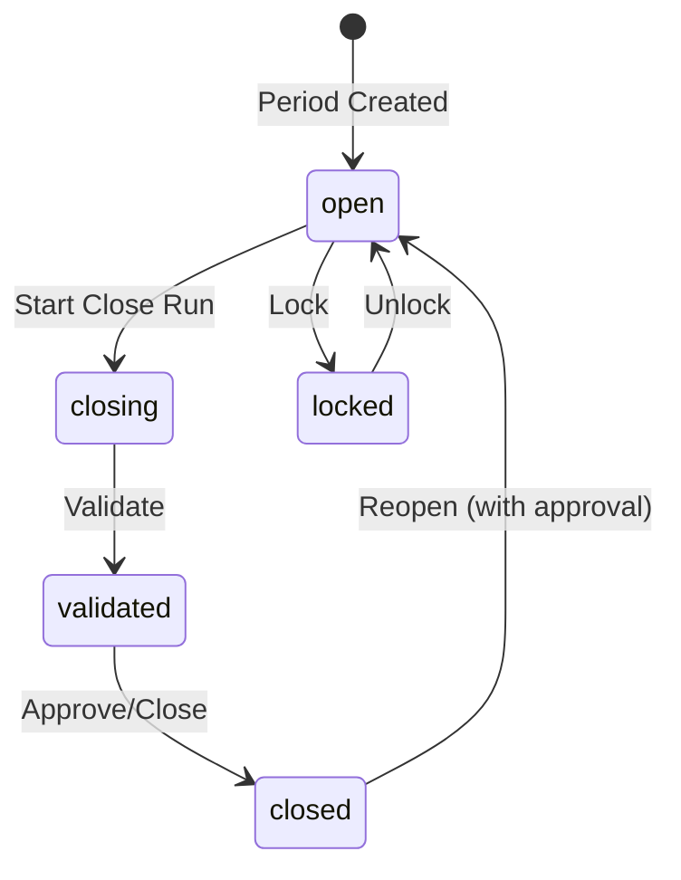

## Bank Reconciliation
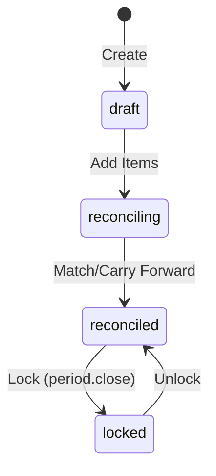

## WHT Filing
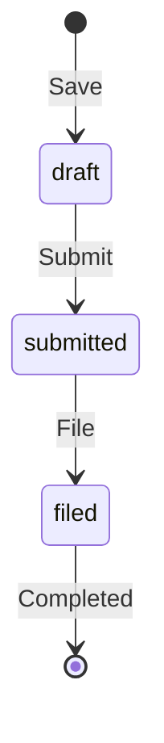

## PP30 (VAT Return)
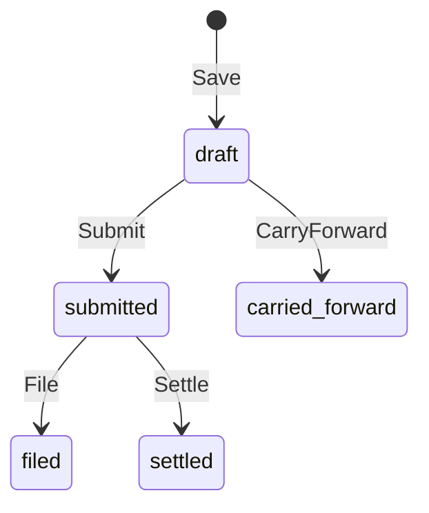

## Year-End Closing
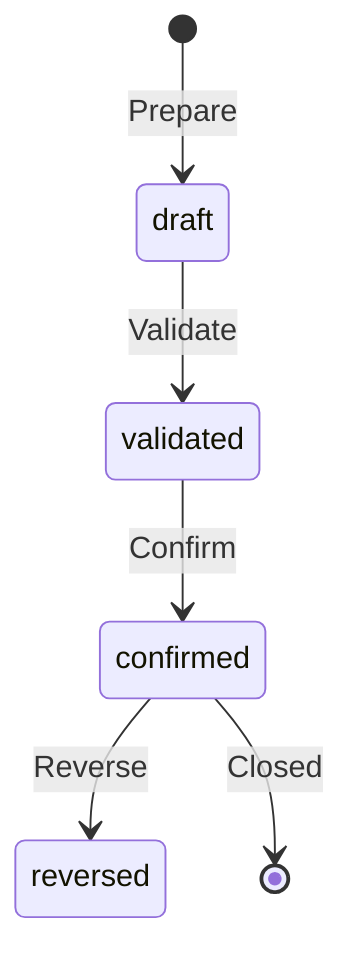

## Tenant Status
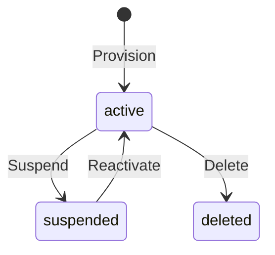
