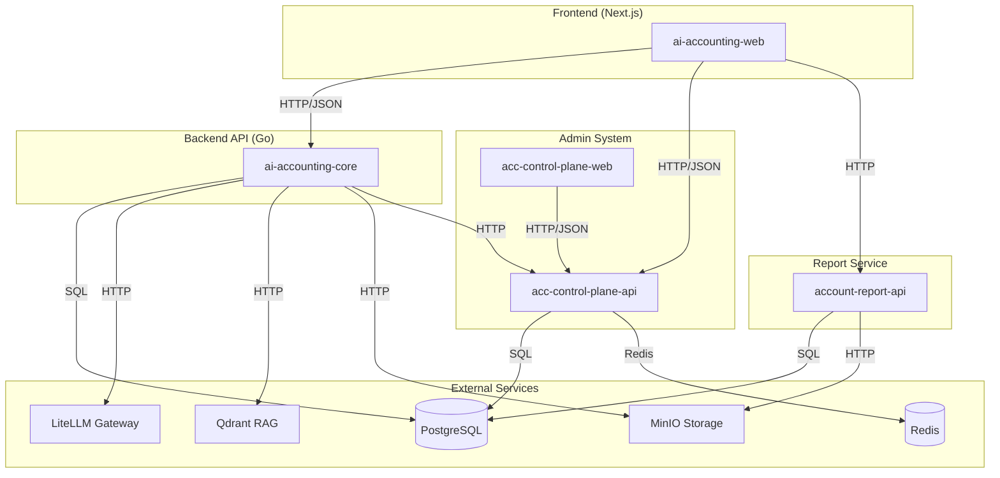
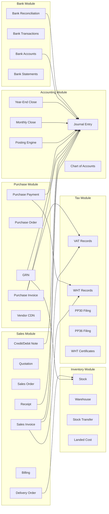
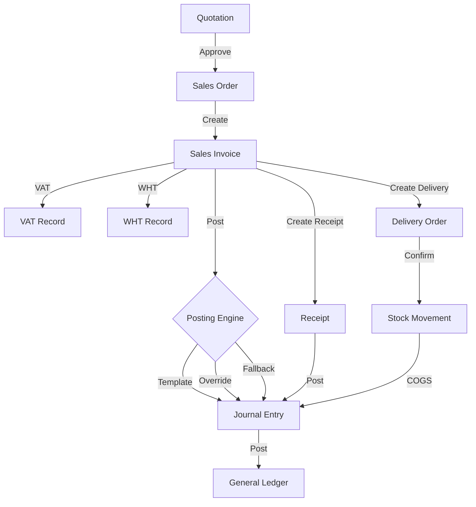
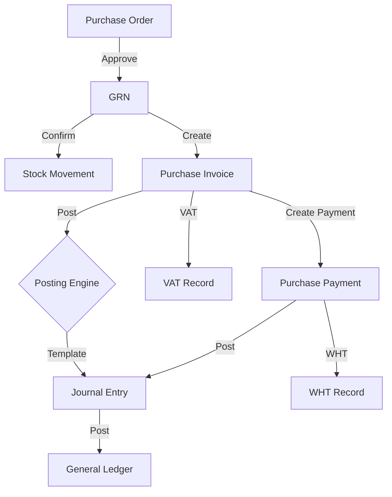
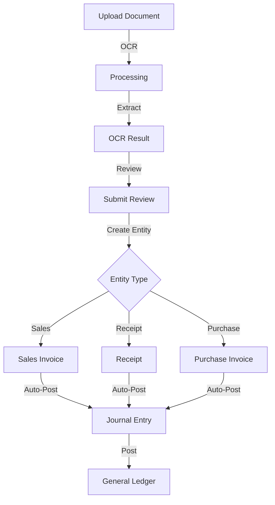

# AI-ACC System Map
> Generated: 2026-09-20

## Module Dependency Graph

## Internal Module Dependencies

## Data Flow: Sales to GL

## Data Flow: Purchase to GL

## Data Flow: Document OCR to GL

## Cross-Module Shared Services

| Service | Used By | Purpose |
|---------|---------|---------|
| PostingEngine | Sales, Purchase, Receipt, Payment, CDN, Payroll, Fixed Asset, Document | Template-driven Dr/Cr rendering |
| DocumentNumberService | All document types | Auto-generated document numbers |
| JournalService | All financial modules | Journal entry CRUD + posting |
| AccountService | All modules | Chart of accounts lookup |
| StockService | Sales, Purchase, GRN, Delivery | Stock movements and costing |
| CompanyService | All modules | Company configuration and settings |
